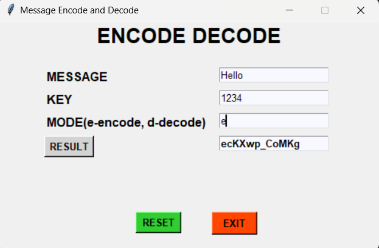
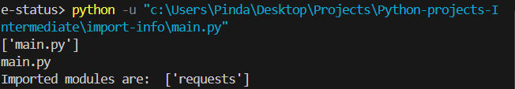

# Python-projects-Intermediate
Level up from BASICS to INTERMEDIATE

1. Encode Decode
This program use tkinter, base64 to provide GUI program to Encode or Decode 

2. Import Info
This program use os module to importing the info which python package is used.

